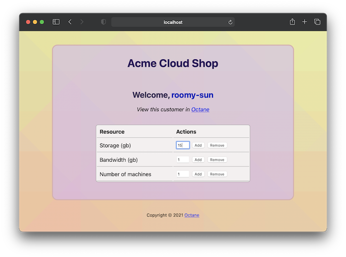

# Example: Acme Cloud Shop

This is a simple Node.js webapp that makes use
of `octane-node`.



## Background

Imagine you are a fledgling cloud-computing company ("Acme Cloud Shop")
selling servers and other cloud resources, changing your customers for the following:

- Storage ($2/gb/month)
- Bandwidth ($5/gb/month)
- Machines ($10/machine/month)

You want to allow your customers to self-service the number
of resources available in their account, and charge them at the
end of each month based on what they've used.

Octane can help with that!

## How it works

Upon startup, the server will ensure that you have various
Octane meters setup (`storage`, `bandwidth`, and `machines`), and
an Octane price plan called `acmecloud`. If they do not
already exist, they will be created for you.

When a user first visits the site, a random customer name
will be generated for them. This will also add an
associated Octane customer, and subscribe them to the
price plan.

When the user clicks one of the "Add" or "Remove" buttons
in the browser next to one of the resources, this will send
a measurement to the Octane API for the associated meter,
with a value based on the number provided in the input box.

## How to run

Install the necessary dependencies:

```
npm install
```

Export your Octane API key:

```
 export OCTANE_API_KEY="<api_key_here>"
```

Run the server (source: [server.js](./server.js)):

```
npm start
```

The app will be available
at [http://localhost:3000/](http://localhost:3000/)

## Customization

The following environment variables can be overridden
to modify server settings, change resource rates, etc:

```
export APP_PORT=3000
export APP_BIND=127.0.0.1
export OCTANE_PRICE_PLAN_NAME=acmecloud
export OCTANE_METER_NAME_STORAGE=storage
export OCTANE_METER_NAME_BANDWIDTH=bandwidth
export OCTANE_METER_NAME_MACHINES=machines
export OCTANE_METER_RATE_STORAGE=2
export OCTANE_METER_RATE_BANDWIDTH=5
export OCTANE_METER_RATE_MACHINES=10
```
