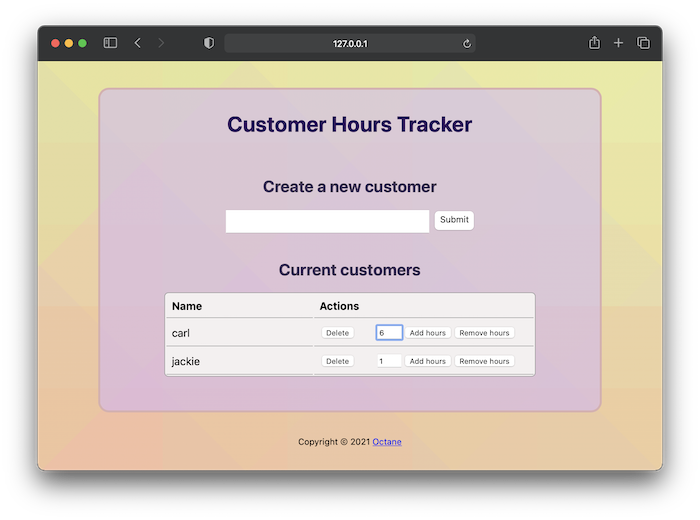

# Example: Customer Hours Tracker

This is a simple Node.js webapp that makes use
of `octane-node`.



## Background

Imagine you are a freelancer with multiple customers/clients.
You have a standard hourly rate ($30/hour).

At the end of each day, you want to track how many hours
you have spent working for each of your customers.

Octane can track that for you!

## How it works

Upon startup, the server will ensure that you have an
Octane meter called `hours`, and an Octane
price plan called `standard`. If they do not
already exist, they will be created for you.

When you add a customer in the browser, this will add an
associated Octane customer, and subscribe them to the
price plan.

When you click the "Add hours" button in the browser next to
a customer, this will send a measurement to the Octane API
for the meter, with a value based on the number of hours
provided in the input box.

When you click the "Delete" button in the browser next to
a customer, this will unsubscribe the associated Octane customer
from the price plan, and then delete them.

## How to run

Install the necessary dependencies:

```
npm install
```

Export your Octane API key:

```
 export OCTANE_API_KEY="<api_key_here>"
```

Run the server (source: [server.js](./server.js)):

```
npm start
```

The app will be available
at [http://localhost:3000/](http://localhost:3000/)

## Customization

The following environment variables can be overridden
to modify server settings, use a custom hourly rate, etc:

```
export APP_PORT=3000
export APP_BIND=127.0.0.1
export OCTANE_METER_NAME=hours
export OCTANE_PRICE_PLAN_NAME=standard
export OCTANE_PRICE_PLAN_RATE=30
```
